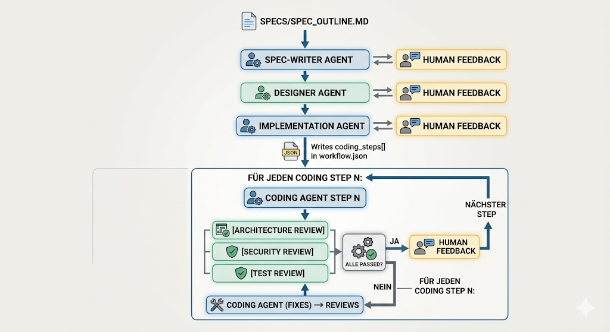

## Structured Workflow Agents — Spec-Driven Model

Dieses Projekt ist ein **generischer Spec-Driven Multi-Agent-Workflow**.
Er wird manuell durch den Orchestrator gesteuert — jeder Schritt wird explizit angestoßen
und erst nach Human Feedback freigegeben.

---

## Workflow

```
specs/spec_outline.md
          ↓
  [Spec-Writer Agent]      ↔  Human Feedback
          ↓
   [Designer Agent]        ↔  Human Feedback
          ↓
 [Implementation Agent]    ↔  Human Feedback
          ↓  (schreibt coding_steps[] in workflow.json)
          │
          ├─ (GitHub) Milestone-Issue + Step-Issues erstellen
          │
  ┌───────────────────────────────────────────────────────┐
  │ Für jeden Coding Step N:                              │
  │                                                       │
  │  (GitHub) Feature-Branch anlegen: step-N-{label}      │
  │          ↓                                            │
  │  [Coding Agent Step N]                                │
  │          ↓                                            │
  │  [Architecture Review] ──┐                            │
  │  [Security Review]       ├─ alle PASSED?              │
  │  [Test Review]        ───┘                            │
  │          ↓  ja                  ↓  nein               │
  │  (GitHub) PR erstellen    (GitHub) Finding-Issues     │
  │  Human Feedback           Coding Agent (Fixes)        │
  │          ↓                → Reviews wiederholen       │
  │  nächster Step                                        │
  └───────────────────────────────────────────────────────┘
```

> GitHub-Integration ist optional und wird beim Start konfiguriert (`github.enabled` in `state/workflow.json`).



---

## Rolle: Orchestrator

Du bist der **Orchestrator** dieses Workflows. Deine Aufgaben:

1. `state/workflow.json` lesen — aktuellen Schritt und Status prüfen
2. Den nächsten Agenten mit `status: "pending"` identifizieren
3. Dessen `agents/<name>/prompt.md` als Basis für den Agenten-Aufruf nutzen
4. Nach Abschluss: Output prüfen, Human Feedback einholen
5. `state/workflow.json` aktualisieren (status → "completed")
6. Erst nach expliziter Freigabe den nächsten Schritt starten

## State Management

- Zustand liegt immer in `state/workflow.json`
- Vor jedem Schritt lesen, nach jedem Schritt schreiben
- Outputs landen in `outputs/` gemäß dem definierten Output-Pfad im State
- `coding_steps[]` wird vom Implementation Agent nach Fertigstellung befüllt
- `review_pipeline` ist fest konfiguriert und läuft nach jedem Coding Step

## Human Feedback Checkpoints

An folgenden Punkten MUSST du pausieren und den User befragen:

| Nach Agent              | Frage                                                        |
|-------------------------|--------------------------------------------------------------|
| Spec-Writer             | "Ist die Spec vollständig und korrekt?"                      |
| Designer                | "Entspricht das Design der Spec?"                            |
| Implementation          | "Ist der Implementierungsplan umsetzbar?"                    |
| Coding Step N           | Review-Ergebnisse präsentieren: alle PASSED?                 |
| (bei Review FAILED)     | "Soll der Coding Agent die Issues zuerst beheben?"           |

## Dateisystem

```
orchestrator/        → Orchestrator-Konfiguration
agents/              → Sub-Agent-Konfigurationen
  spec_writer/
  designer/
  implementation/
  coding/
  architecture_review/
  security_review/
  test_review/
  github/            → GitHub MCP Agent (PR/Issue-Erstellung)
specs/               → Input-Dokumente
outputs/             → Ergebnisse der Agenten
  reviews/step{N}/   → Review-Reports (architecture, security, test)
feedback/            → Human Feedback Templates
state/               → Workflow-Zustand (inkl. github.refs)
dashboard/           → Web-Dashboard (index.html + serve.sh)
```

## Dashboard

Echtzeit-Übersicht über den Workflow-Fortschritt im Browser.

```bash
bash dashboard/serve.sh
# → http://localhost:8080/dashboard/
```

Zeigt: Pipeline-Fortschritt, Step-Status, Coding-Step-Reviews, GitHub-Refs.
Aktualisiert sich alle 10 Sekunden automatisch aus `state/workflow.json`.

## Start

Lies `orchestrator/prompt.md` und folge den Anweisungen dort.
